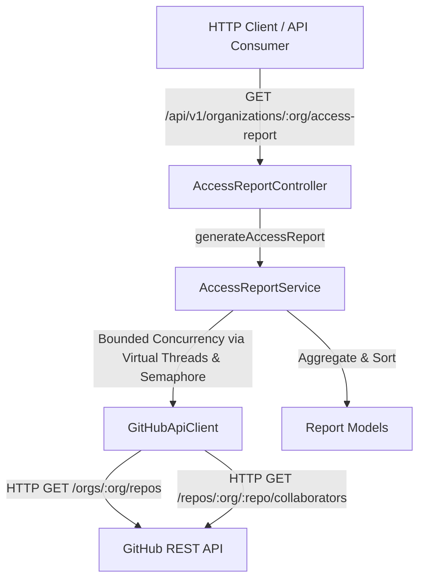

# GitHub Access Report Service

A Spring Boot 4 & Java 21 microservice that connects to the GitHub REST API, retrieves all repositories within a given organization, determines user permissions for each repository, aggregates repository access by user, and exposes the aggregated report through a REST API.

---

## Architecture Overview

The application follows a clean, layered architecture separating HTTP communication, domain processing, and REST exposure:



### Layer Responsibilities

* **`config`**: Binds external settings (`github.token`, `github.concurrency`, etc.) via `@ConfigurationProperties` and builds a thread-safe `RestClient` bean.
* **`client`**: Encapsulates raw HTTP communication with GitHub API. Manages `Authorization` headers, standard GitHub API version headers (`2022-11-28`), pagination, and maps raw HTTP status codes to custom domain exceptions.
* **`service`**: Implements high-throughput, bounded concurrent processing using Java 21 Virtual Threads (`Executors.newVirtualThreadPerTaskExecutor()`) and `Semaphore`. Aggregates repository-centric collaborator responses into user-centric mappings and handles sorting.
* **`controller`**: Thin REST layer handling request routing, validation, and delegating execution to the service layer.
* **`exception`**: Centralized exception handling (`@RestControllerAdvice`) delivering consistent, standardized JSON error responses.

---

## Prerequisites

* **Java**: 21 or higher
* **Build Tool**: Maven 3.8+ (or included `./mvnw` wrapper)
* **GitHub Token**: Personal Access Token (PAT) or Fine-Grained Personal Access Token with appropriate read access.

---

## GitHub Token Setup & Required Permissions

### Required Permissions
The configured `GITHUB_TOKEN` must have the following scopes:
* **Classic PAT**: `repo` (Full control of private repositories) or `public_repo` (for public-only repositories) and `read:org`.
* **Fine-Grained PAT**: 
  * Repository permissions: `Contents` (Read), `Metadata` (Read), `Administration` (Read)
  * Organization permissions: `Members` (Read)

### Setting the Environment Variable

#### Linux / macOS:
```bash
export GITHUB_TOKEN=ghp_your_personal_access_token_here
```

#### Windows (Command Prompt):
```cmd
set GITHUB_TOKEN=ghp_your_personal_access_token_here
```

#### Windows (PowerShell):
```powershell
$env:GITHUB_TOKEN="ghp_your_personal_access_token_here"
```

---

## Configuration

Configuration parameters are externalized in `src/main/resources/application.yml`:

```yaml
github:
  base-url: ${GITHUB_BASE_URL:https://api.github.com}
  token: ${GITHUB_TOKEN:}
  page-size: 100
  concurrency: 10
  timeout-seconds: 10

spring:
  application:
    name: github-access-report
```

| Property | Default Value | Description |
| :--- | :--- | :--- |
| `github.base-url` | `https://api.github.com` | Target GitHub API Base URL |
| `github.token` | `${GITHUB_TOKEN}` | GitHub Personal Access Token |
| `github.page-size` | `100` | Number of items requested per page (max 100) |
| `github.concurrency` | `10` | Maximum parallel collaborator request permits |
| `github.timeout-seconds` | `10` | HTTP connect and read timeout in seconds |

---

## Running the Application

### Using Maven Wrapper
```bash
mvn spring-boot:run
```

### Running the Packaged JAR
```bash
mvn clean package
java -jar target/github-access-report-0.0.1-SNAPSHOT.jar
```

The server starts by default on port `8080`.

---

## API Endpoint Documentation

### Generate Access Report

```http
GET /api/v1/organizations/{organization}/access-report
```

#### Path Parameters
* `organization` *(String, required)*: The GitHub organization login name (e.g. `example-org`, `google`, `github`).

#### Response Headers
* `Content-Type: application/json`

#### Example Request
```bash
curl -i -X GET http://localhost:8080/api/v1/organizations/example-org/access-report
```

#### Example Successful Response (200 OK)
```json
{
  "organization": "example-org",
  "generatedAt": "2026-08-24T10:30:00Z",
  "totalRepositories": 2,
  "totalUsers": 2,
  "users": [
    {
      "username": "alice",
      "repositories": [
        {
          "repositoryName": "repo-one",
          "repositoryFullName": "example-org/repo-one",
          "permission": "admin"
        },
        {
          "repositoryName": "repo-two",
          "repositoryFullName": "example-org/repo-two",
          "permission": "push"
        }
      ]
    },
    {
      "username": "bob",
      "repositories": [
        {
          "repositoryName": "repo-one",
          "repositoryFullName": "example-org/repo-one",
          "permission": "pull"
        }
      ]
    }
  ]
}
```

#### Example Error Response (404 Not Found)
```json
{
  "timestamp": "2026-08-24T01:54:00Z",
  "status": 404,
  "error": "Organization Not Found",
  "message": "GitHub organization 'nonexistent-org' was not found",
  "path": "/api/v1/organizations/nonexistent-org/access-report"
}
```

---

## Scalability & Technical Design

### 1. Pagination
GitHub REST API paginates results. The client fetches pages sequentially using `per_page=100`. It continues requesting page 1, 2, ... until a page returns fewer items than `per_page` (or an empty array), ensuring complete data retrieval without duplicate API calls or missed items.

### 2. Bounded Concurrency
To scale for organizations with **100+ repositories** and **1000+ users**:
* Sequential fetching of collaborators for 100+ repos would take 100+ round trips (~50-100 seconds).
* Unbounded parallel fetching would overwhelm connection pools and trigger GitHub secondary rate limits.
* Solution: We combine **Java 21 Virtual Threads** (`Executors.newVirtualThreadPerTaskExecutor()`) with a configurable **`Semaphore`** bounded by `github.concurrency` (default: 10). This provides high throughput without exceeding connection limits.

### 3. Aggregation & Sorting
GitHub API returns repository-centric collaborator lists:
```text
Repo A -> [Alice (admin), Bob (push)]
Repo B -> [Alice (pull)]
```
The service aggregates this into a user-centric mapping:
```text
Alice -> [Repo A (admin), Repo B (pull)]
Bob   -> [Repo A (push)]
```
* Users are sorted alphabetically by `username` (case-insensitive).
* Repositories for each user are sorted alphabetically by `repositoryName` (case-insensitive).

### 4. Rate Limits & Security
* **Tokens**: Tokens are injected solely via environment variables or configuration. They are never hardcoded, logged, or returned in API responses.
* **Rate Limits**: 403 / 429 response status codes from GitHub API are cleanly intercepted and mapped to appropriate standard error payloads.

---

## Running Tests

Execute the unit and integration test suite:

```bash
mvn clean test
```

### Test Coverage Highlights
* **`GitHubApiClientTest`**: Verifies HTTP header injection (`Authorization: Bearer <token>`, `Accept`, `X-GitHub-Api-Version`), multi-page pagination behavior, and HTTP 404 / 401 exception handling using `MockRestServiceServer`.
* **`AccessReportServiceTest`**: Validates repository collaborator aggregation, cross-repository user permissions grouping, alphabetical user/repository sorting, empty organization handling, and bounded concurrency.
* **`AccessReportControllerTest`**: Verifies REST endpoints, path variable validation, HTTP response statuses (200, 404, 401), and `@RestControllerAdvice` error formatting using `MockMvc`.

---

## Building for Production

```bash
mvn clean package
```

This compiles all source files, runs all unit/integration tests, and generates an executable Uber JAR in `target/github-access-report-0.0.1-SNAPSHOT.jar`.
# Github-Report
# Github-Report
